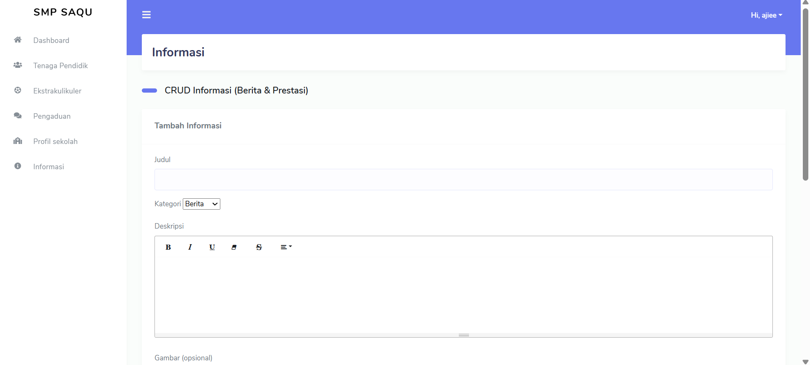
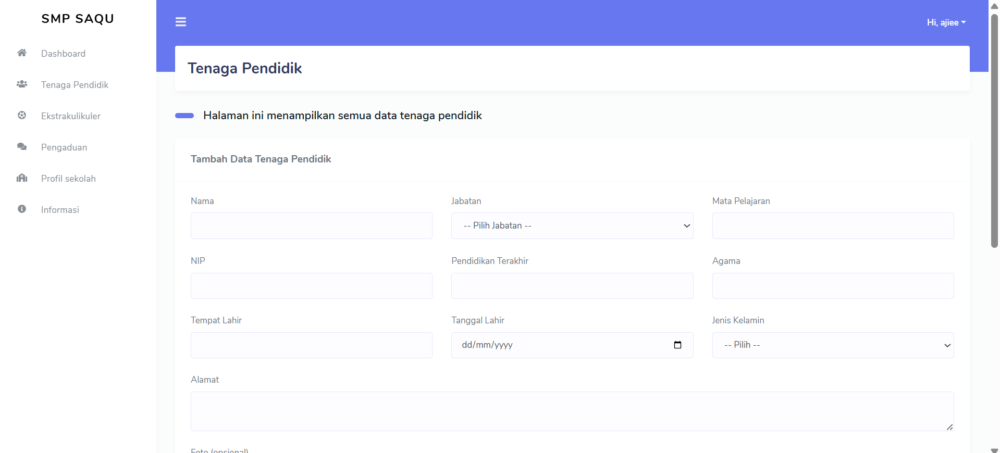

# 🏫 School Website Information System

Aplikasi **School Website Information System** merupakan platform berbasis **web** yang dirancang untuk menyediakan informasi lengkap mengenai sekolah kepada siswa, orang tua, dan masyarakat.

Website ini bertujuan untuk mempermudah penyampaian informasi sekolah seperti **profil sekolah, data guru, berita sekolah, kegiatan, pengumuman, serta galeri dokumentasi** sehingga informasi dapat diakses dengan mudah melalui internet.

Dengan adanya website ini, sekolah dapat meningkatkan **transparansi informasi, komunikasi dengan masyarakat, serta memperluas akses informasi pendidikan secara digital**.

Project ini dikembangkan sebagai bagian dari **pembelajaran pengembangan web** serta sebagai latihan dalam membangun sistem informasi berbasis website.

---

# 🚀 Features

Beberapa fitur utama dalam aplikasi ini antara lain:

### 🏫 Profil Sekolah
Menampilkan informasi mengenai sekolah seperti sejarah sekolah, visi dan misi, serta struktur organisasi.

### 👨‍🏫 Data Guru
Menampilkan daftar guru yang mengajar di sekolah lengkap dengan informasi dasar seperti nama, mata pelajaran, dan foto guru.

### 📰 Berita Sekolah
Menyediakan informasi berita terbaru mengenai kegiatan sekolah.

### 📢 Pengumuman
Menampilkan pengumuman penting yang perlu diketahui oleh siswa dan masyarakat.

### 🖼️ Galeri Sekolah
Menampilkan dokumentasi kegiatan sekolah dalam bentuk foto.

### 📚 Informasi Akademik
Menyediakan informasi terkait kegiatan akademik maupun kegiatan sekolah lainnya.

### 📱 Responsive Web Design
Website dapat diakses dengan baik melalui berbagai perangkat seperti desktop, tablet, maupun smartphone.

---

# 🛠 Tech Stack

Teknologi yang digunakan dalam pengembangan aplikasi ini:

| Technology | Description |
|-----------|-------------|
| PHP | Bahasa pemrograman backend |
| MySQL | Database management system |
| HTML5 | Struktur halaman web |
| CSS3 | Styling halaman |
| JavaScript | Interaktivitas pada website |
| Bootstrap | Framework UI |

---

# 📂 Project Structure

Struktur folder utama pada project:

```
school-website
│
├── assets
│   ├── css
│   ├── js
│   └── images
├── config
├── pages
├── includes
├── database
└── README.md
```

---

# ⚙️ Installation

Ikuti langkah berikut untuk menjalankan project secara lokal.

### 1. Clone repository

```
git clone https://github.com/username/school-website.git
```

### 2. Masuk ke folder project

```
cd school-website
```

### 3. Pindahkan project ke folder web server

Letakkan folder project ke dalam folder server seperti:

```
htdocs (XAMPP)
atau
www (Laragon)
```

### 4. Setup database

1. Buka **phpMyAdmin**
2. Buat database baru
3. Import file database yang tersedia pada folder:

```
database/
```

### 5. Jalankan project

Buka browser dan akses:

```
http://localhost/school-website
```

---

# 📸 Application Preview

Sedikit Preview

```



```

---

# 🎯 Project Goals

Tujuan utama dari pengembangan aplikasi ini:

- Menyediakan informasi sekolah secara digital
- Mempermudah masyarakat dalam mengakses informasi sekolah
- Menampilkan data guru dan aktivitas sekolah secara online
- Mengembangkan keterampilan pengembangan website
- Mendukung digitalisasi informasi pendidikan

---

# 📄 License

Project ini dibuat untuk **tujuan pembelajaran dan pengembangan portfolio**.
